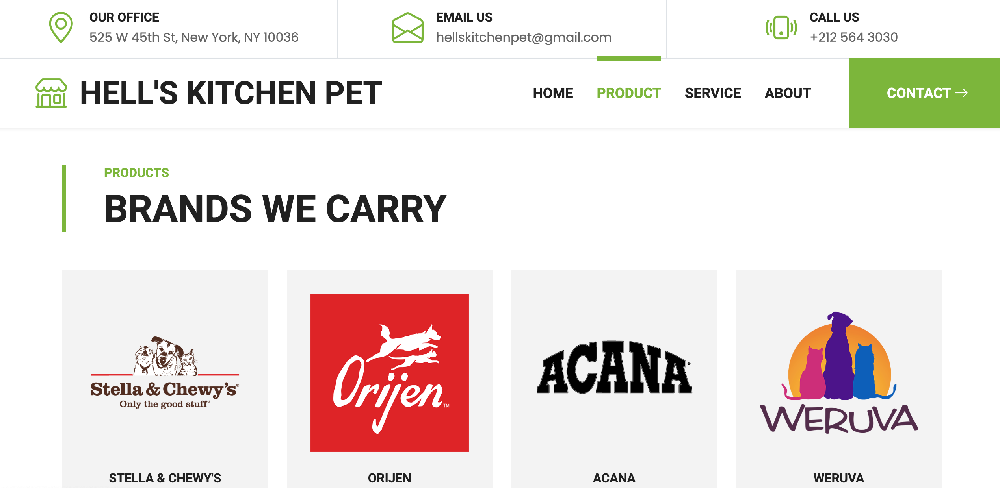

## What is this
A responsive, user-friendly website built for Hell's Kitchen Pet, a local pet care business offering grooming, pet walking, and pet supplies.
This project showcases a clean design, intuitive navigation, and essential business information to enhance customer engagement and promote services online.

## Purpose
To provide Hell’s Kitchen Pet with a professional online presence that supports both customer acquisition and service inquiries.

## Screenshots 
### 🏠 Home Page 

### 🏠 About Page

### 🛍️ Products Page

### 📱 Responsive Design
<video width="600" controls>
  <source src="./assets/Services.mov" type="video/quicktime">
  
  Your browser does not support the video tag.
</video>

## Who to contact

For inquiries, collaborations, or contributions, contact: 
Antonious Yakoub 
Email: [antyakoub@gmail.com] 
GitHub: [https://github.com/antyakoub] 
LinkedIn: [https://www.linkedin.com/in/antyakoub/] 
